### Project BookList MVC Spring
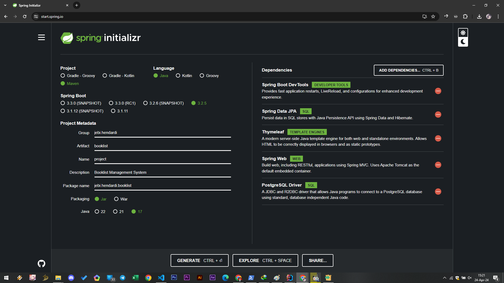

## Table of Contents

- [ Dependencies](#-dependencies-)
- 
[ Project Structure](#ProjectStructure)
- [ PostgreSQL Config](#psqlconfig)
- [ Test Running](#test)

##  Dependencies :
- `Spring Boot Dev Tools`
- `Spring Data JPA`
- `Thymeleaf`
- `Spring Web`
- `PostgreSQL Driver`

##  Project Structure :

* `controller` : BookController.java
* `entity` : Book.java
* `repository` : BookRepository.java
* `service` : BookService.java, BookServiceImpl.java
* `main` : ProjectApplication.java
* `resources/templates (webpages)` : books.html, create_book.html, edit_book.html

##  PostgreSQL Config :
* `Config Database, Schema and Table` : 
  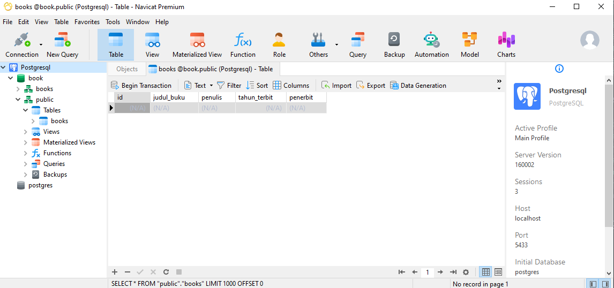
  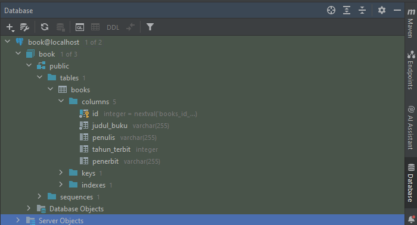

* `Config Application.properties` :
  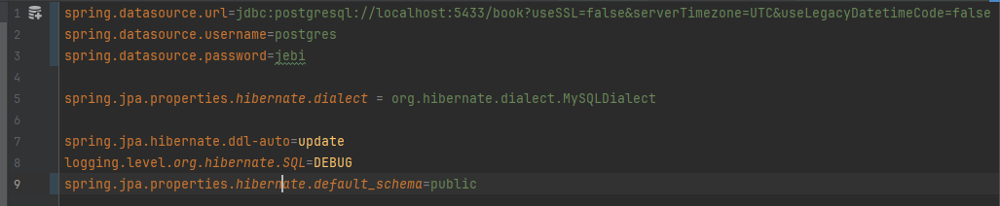

##  Test Running
* `Home Page`
  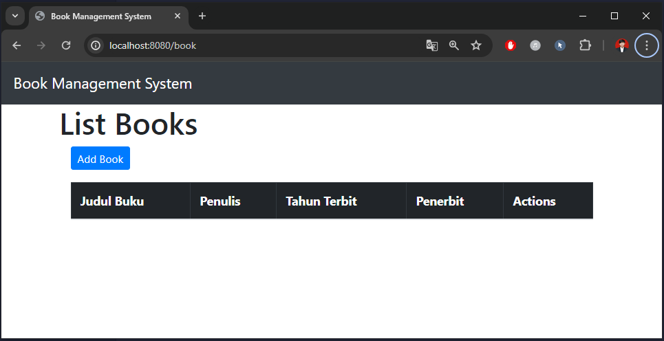

#
* `Add New Book`
  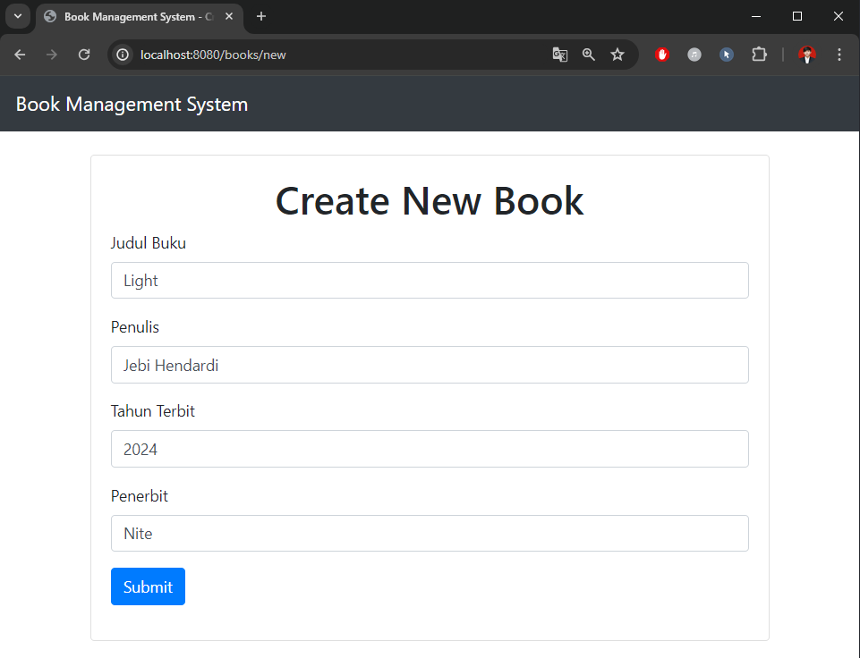

  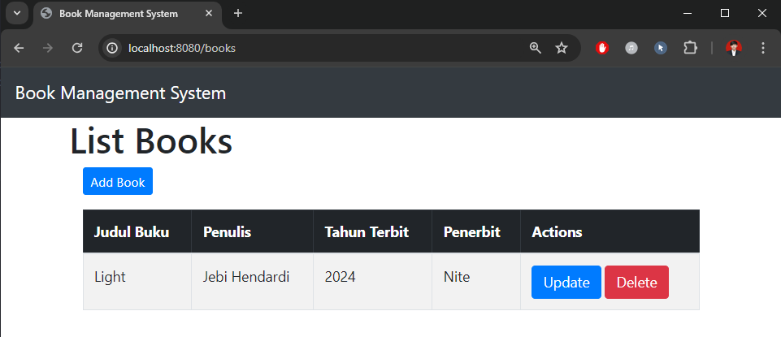

  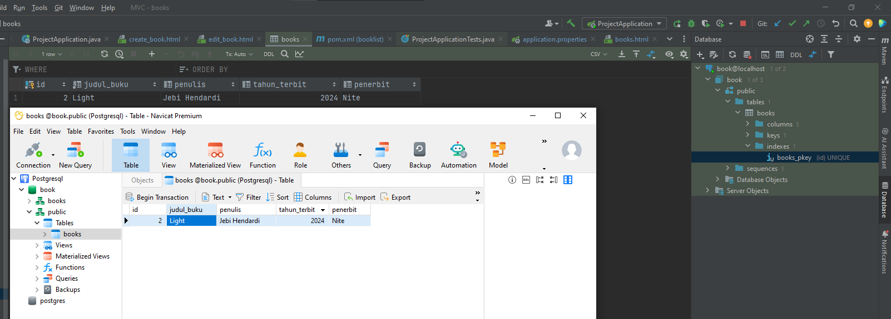

#
* `Edit Book`
  
  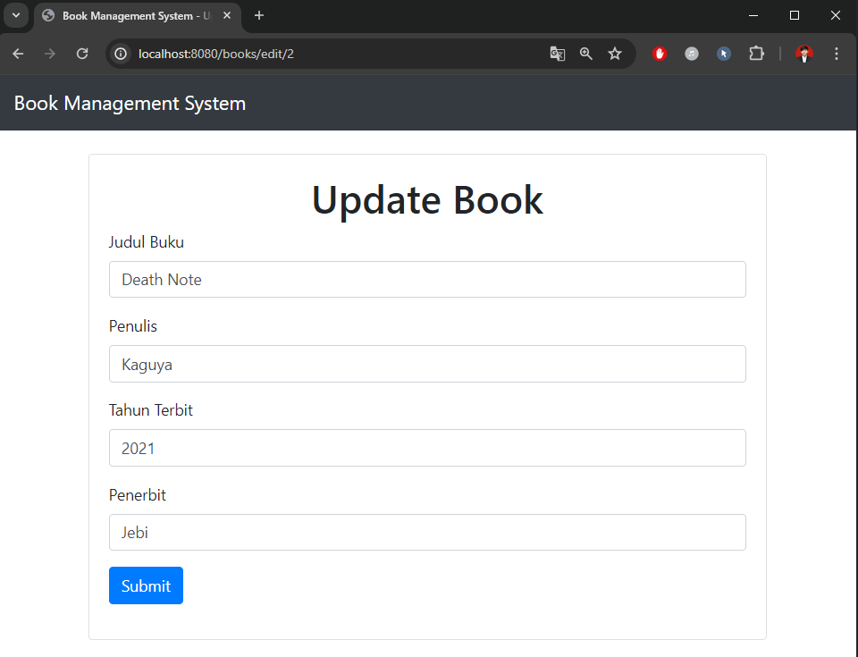
  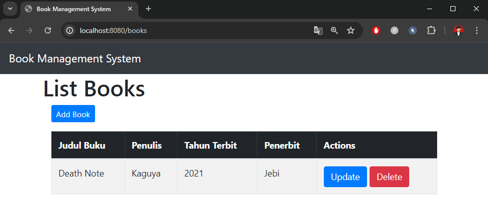
  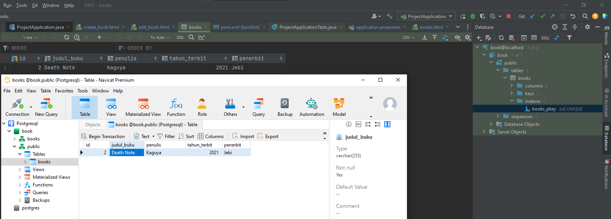

#
* `Delete Book`
  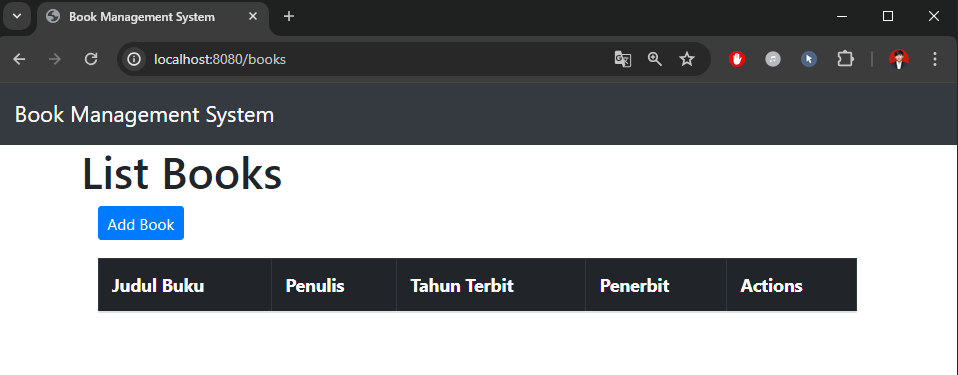
  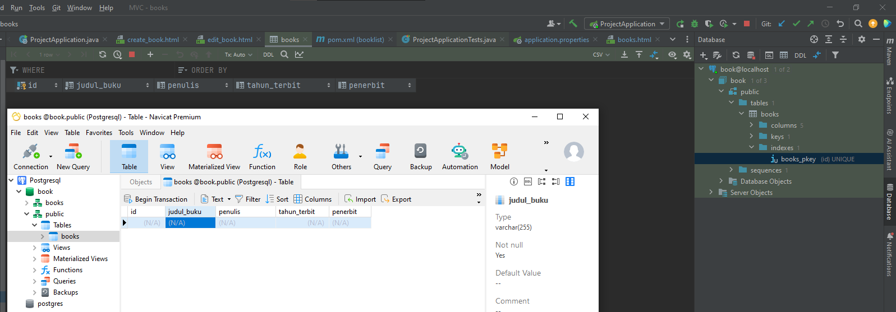